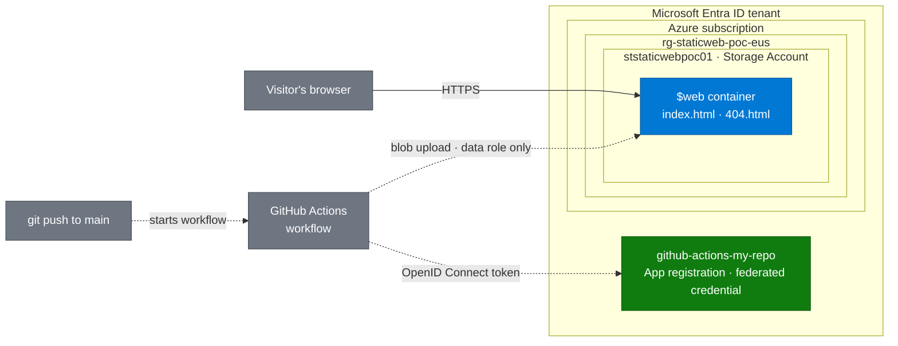

# Architecture Diagram Standard

A single set of rules for every architecture diagram across my Azure projects, so each repo looks consistent and each diagram can be read in under ten seconds.

---

## 1. Pick the tool

| Use **Mermaid** when… | Use **draw.io** (diagrams.net) when… |
|---|---|
| The design fits in a flowchart of 12 nodes or fewer | You want official Azure service icons |
| You want the diagram to live as text inside the README | You need nested network boundaries (virtual networks, subnets, private endpoints) |
| The diagram will change often as the project evolves | You want a polished standalone image for LinkedIn or a Loom thumbnail |

**Default to Mermaid.** Move to draw.io only when Mermaid starts to feel cramped.

Mermaid is a text-based diagram format that GitHub renders as a real picture automatically. draw.io is a free visual editor; saving as `.drawio.png` gives one file that displays as an image *and* reopens as an editable diagram.

---

## 2. Visual rules (both tools)

1. **Two paths, two line styles.**
   - Solid arrow = the **request path** (how a user reaches the app).
   - Dashed arrow = the **deploy path** (how code gets to Azure).
2. **Boundaries are boxes.** Draw the Microsoft Entra ID tenant, subscription, resource group, and (later) virtual network as labeled containers, outermost to innermost. Identities such as app registrations sit in the tenant, outside the subscription.
3. **Three colors only.**
   - Azure resources: Azure blue `#0078d4`, white text
   - External systems (GitHub, users, third-party APIs): neutral gray `#6e7681`, white text
   - Security or identity (Entra ID, OpenID Connect, Key Vault, role assignments): green `#107c10`, white text
4. **Label every arrow** with *what* travels on it: `HTTPS`, `OpenID Connect token`, `blob upload`.
5. **Name nodes with the real resource name** plus the service type on a second line, e.g. `ststaticwebpoc01` / `Storage Account`.
6. **Flow direction:** left to right (`LR`) for pipelines, top to bottom (`TD`) for layered architectures. Pick one per diagram.
7. **No more than 12 nodes.** If it needs more, split it into an overview diagram and a detail diagram.

---

## 3. Where diagrams live in each repo

```
docs/
└── architecture/
    ├── overview.drawio.png   (only if draw.io is used)
    └── README-snippet.md     (optional notes)
```

- Mermaid diagrams go **directly in the main README** under the `## Architecture` heading.
- draw.io exports go in `docs/architecture/` and are embedded in the README with a relative image link.
- Always put a one-sentence caption under the diagram explaining what it shows.

---

## 4. Mermaid template

Copy this, then rename nodes for the new project.



*Caption: Visitors reach the site over HTTPS from the storage account's static website endpoint; code changes reach the same container through GitHub Actions, which signs in with a short-lived OpenID Connect token instead of a stored password.*

---

## 5. draw.io setup (when needed)

1. Open [app.diagrams.net](https://app.diagrams.net) or install the **Draw.io Integration** extension in Cursor / VS Code.
2. Enable Azure icons: *More Shapes → Networking → Azure* (and the newer *Azure 2* set if shown).
3. Apply the same three colors and two line styles from Section 2.
4. Save as **`overview.drawio.png`** (File → Export as → PNG, tick *Include a copy of my diagram*). That one file both renders on GitHub and reopens for editing.
5. Embed in the README:
   ```markdown
   
   ```

---

## 6. Pre-publish checklist

- [ ] Renders correctly on the GitHub repo page (check in the browser, not just the editor)
- [ ] Request path solid, deploy path dashed
- [ ] Every arrow labeled
- [ ] Only the three standard colors
- [ ] Real resource names match the deploy scripts
- [ ] 12 nodes or fewer
- [ ] Caption written under the diagram
- [ ] Readable in dark mode and light mode on GitHub
